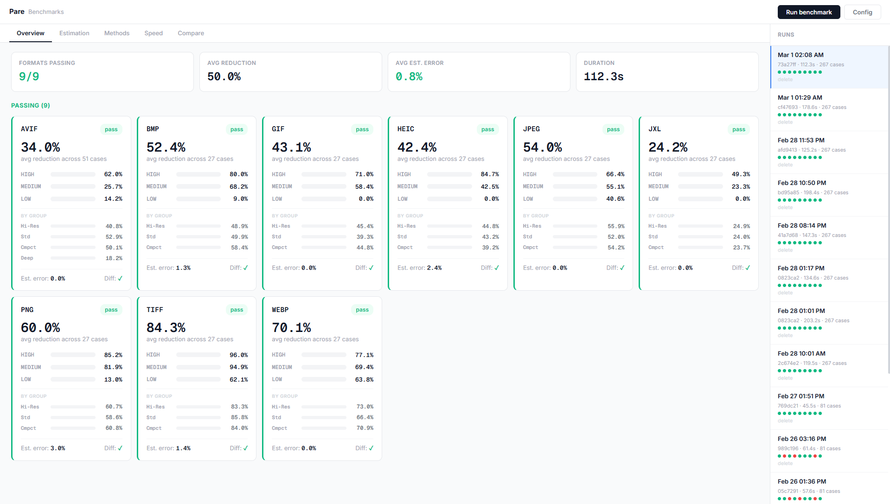

# Pare: Image Compression Service

[](LICENSE) [](https://www.python.org/downloads/release/python-3120/) [](https://ghcr.io/amitray007/pare) [](https://github.com/amitray007/pare/actions/workflows/tests.yml) [](https://github.com/amitray007/pare/actions/workflows/lint.yml) [](https://github.com/amitray007/pare/actions/workflows/release.yml)

<p align="center">
  
</p>

A serverless image compression and optimization API built on FastAPI + Google Cloud Run. Optimizes 12 image formats using format-specific pipelines that combine CLI tools (pngquant, oxipng, jpegli, gifsicle, cwebp, cjxl/djxl) with Python libraries (Pillow, pillow-heif, pillow-avif-plugin, jxlpy, scour).

## Supported Formats

| Format | Tool/Library | Strategy |
|--------|-------------|----------|
| PNG/APNG | pngquant + oxipng | Lossy quantization + lossless recompression |
| JPEG | Pillow/jpegli + jpegtran | Lossy re-encode + lossless Huffman optimization |
| WebP | cwebp + Pillow | Quality-based lossy/lossless encoding |
| GIF | gifsicle | Lossy/lossless with color reduction |
| SVG/SVGZ | Scour | Attribute/element cleanup, precision reduction |
| AVIF | pillow-avif-plugin | Quality-based AV1 encoding |
| HEIC | pillow-heif | Quality-based HEVC encoding |
| TIFF | Pillow | Adobe Deflate, LZW, or JPEG-in-TIFF (parallel) |
| BMP | Pillow + custom RLE8 | Palette quantization + content-aware RLE8 compression |
| JXL | jxlpy (pillow-jxl-plugin) | Quality-based JPEG XL re-encoding |

## Quick Start

```bash
# Install dependencies
pip install -r requirements.txt

# Run locally
uvicorn main:app --reload --port 8080

# Or with Docker (includes all CLI tools + Redis)
docker-compose up
```

## API Reference

All endpoints return a `X-Request-ID` header (UUID) for request tracing.

### Authentication

Bearer token via the `Authorization` header. Configure via the `API_KEY` environment variable.

```
Authorization: Bearer <your-api-key>
```

When `API_KEY` is empty (default), the service runs in dev mode — no authentication required.

### Error Responses

All errors return JSON with this structure:

```json
{
  "success": false,
  "error": "<error_code>",
  "message": "Human-readable description"
}
```

The `X-Request-ID` response header is included on all responses (including errors). Some errors include additional context fields in the body — e.g., `retry_after` and `limit` for rate limit errors, `file_size` and `limit` for file-too-large errors.

| Status | Error Code | Description |
|--------|-----------|-------------|
| `400` | `bad_request` | Invalid JSON, missing fields, malformed body |
| `401` | `unauthorized` | Missing or invalid API key |
| `413` | `file_too_large` | File exceeds `MAX_FILE_SIZE_MB` (default 32 MB) |
| `415` | `unsupported_format` | Format not recognized by magic bytes detection |
| `422` | `ssrf_blocked` | URL points to a private/reserved IP range |
| `422` | `url_fetch_failed` | URL fetch timed out or failed |
| `422` | `optimization_failed` | Compression pipeline error |
| `500` | `tool_timeout` | CLI tool exceeded timeout |
| `429` | `rate_limit_exceeded` | Rate limit hit (includes `retry_after` field) |
| `503` | `service_overloaded` | Compression queue full |

---

### POST /optimize

Compress an image. Accepts multipart file upload or JSON with a URL. The optimized image is never larger than the input — if optimization doesn't reduce size, the original is returned with `method="none"`.

#### Option A: Multipart File Upload

**Request:**

```
POST /optimize
Content-Type: multipart/form-data
Authorization: Bearer <api-key>
```

| Field | Type | Required | Description |
|-------|------|----------|-------------|
| `file` | binary | Yes | Image file to optimize |
| `options` | string (JSON) | No | JSON-encoded optimization and storage config |

The `options` field accepts:

```json
{
  "optimization": {
    "quality": 60,
    "strip_metadata": true,
    "progressive_jpeg": false,
    "png_lossy": true,
    "max_reduction": null
  },
  "storage": {
    "provider": "gcs",
    "bucket": "my-bucket",
    "path": "/optimized/image.png",
    "project": "my-gcp-project",
    "public": false
  }
}
```

**Example:**

```bash
curl -X POST http://localhost:8080/optimize \
  -H "Authorization: Bearer my-api-key" \
  -F "file=@photo.png" \
  -F 'options={"optimization":{"quality": 60, "strip_metadata": true}}' \
  --output optimized.png
```

#### Option B: JSON with URL

**Request:**

```
POST /optimize
Content-Type: application/json
Authorization: Bearer <api-key>
```

```json
{
  "url": "https://example.com/photo.jpg",
  "optimization": {
    "quality": 60,
    "strip_metadata": true,
    "progressive_jpeg": true,
    "png_lossy": true,
    "max_reduction": null
  },
  "storage": {
    "provider": "gcs",
    "bucket": "my-bucket",
    "path": "/optimized/photo.jpg"
  }
}
```

**Example:**

```bash
curl -X POST http://localhost:8080/optimize \
  -H "Content-Type: application/json" \
  -H "Authorization: Bearer my-api-key" \
  -d '{"url": "https://example.com/photo.jpg", "optimization": {"quality": 60}}'  \
  --output optimized.jpg
```

#### Optimization Parameters

| Parameter | Type | Default | Description |
|-----------|------|---------|-------------|
| `quality` | int | 80 | Compression aggressiveness (1-100). Lower = smaller files, more lossy |
| `strip_metadata` | bool | `true` | Remove EXIF, ICC profiles, and other metadata |
| `progressive_jpeg` | bool | `false` | Enable progressive JPEG encoding |
| `png_lossy` | bool | `true` | Allow lossy PNG quantization (pngquant) |
| `max_reduction` | float \| null | `null` | Cap maximum size reduction percentage (0-100) |

#### Storage Parameters (optional)

When provided, the optimized image is uploaded to cloud storage and a JSON response is returned instead of binary data.

| Parameter | Type | Default | Description |
|-----------|------|---------|-------------|
| `provider` | string | — | Storage provider (currently `"gcs"` only) |
| `bucket` | string | — | Bucket name |
| `path` | string | — | Object path (with leading `/`) |
| `project` | string \| null | `null` | GCP project ID |
| `public` | bool | `false` | Make the uploaded file publicly readable |

#### Response: Binary (no storage)

```
HTTP/1.1 200 OK
Content-Type: image/png
Content-Length: 45000
X-Original-Size: 125000
X-Optimized-Size: 45000
X-Reduction-Percent: 64.0
X-Original-Format: png
X-Optimization-Method: pngquant + oxipng
X-Request-ID: 550e8400-e29b-41d4-a716-446655440000

[binary image data]
```

| Response Header | Description |
|----------------|-------------|
| `X-Original-Size` | Original file size in bytes |
| `X-Optimized-Size` | Optimized file size in bytes |
| `X-Reduction-Percent` | Size reduction as a percentage |
| `X-Original-Format` | Detected format (e.g., `jpeg`, `png`, `webp`) |
| `X-Optimization-Method` | Method used (e.g., `jpegli`, `pngquant + oxipng`, `none`) |
| `X-Request-ID` | Request trace identifier |

#### Response: JSON (with storage)

```json
{
  "success": true,
  "original_size": 512000,
  "optimized_size": 234000,
  "reduction_percent": 54.3,
  "format": "jpeg",
  "method": "jpegli",
  "storage": {
    "provider": "gcs",
    "url": "https://storage.googleapis.com/my-bucket/optimized/photo.jpg?X-Goog-Signature=...",
    "public_url": null
  },
  "message": null
}
```

---

### POST /estimate

Predict compression savings without running the full optimizer. Responds in ~50-500ms depending on format and image size.

Uses three estimation strategies internally:
1. **Exact mode** (< 150K pixels, SVG, animated): Full compression simulation
2. **Direct-encode mode** (JPEG, HEIC, AVIF, JXL, WebP, PNG): Downsized sample encoding + BPP extrapolation
3. **Generic fallback** (GIF, BMP, TIFF): Minimal sample + actual optimizer extrapolation

#### Option A: Multipart File Upload

```
POST /estimate
Content-Type: multipart/form-data
Authorization: Bearer <api-key>
```

| Field | Type | Required | Description |
|-------|------|----------|-------------|
| `file` | binary | Yes | Image file to estimate |
| `preset` | string | No | `"high"`, `"medium"`, or `"low"` (overrides options) |
| `options` | string (JSON) | No | JSON-encoded `OptimizationConfig` |

**Example:**

```bash
curl -X POST http://localhost:8080/estimate \
  -F "file=@photo.png" \
  -F "preset=high"
```

#### Option B: JSON with URL

```
POST /estimate
Content-Type: application/json
Authorization: Bearer <api-key>
```

```json
{
  "url": "https://example.com/photo.png",
  "preset": "medium",
  "thumbnail_url": "https://example.com/photo_thumb.png",
  "file_size": 5242880
}
```

| Field | Type | Required | Description |
|-------|------|----------|-------------|
| `url` | string | Yes | HTTPS URL of the image |
| `preset` | string | No | `"high"`, `"medium"`, or `"low"` (default: `"medium"`) |
| `optimization` | object | No | `OptimizationConfig` (ignored if `preset` provided) |
| `thumbnail_url` | string | No | Thumbnail URL for large files |
| `file_size` | int | No | Original file size in bytes (required with `thumbnail_url` for files >= 10 MB) |

#### Quality Presets

| Preset | Quality | Lossy PNG | Behavior |
|--------|---------|-----------|----------|
| `high` | 40 | Yes | Aggressive lossy compression |
| `medium` | 60 | Yes | Moderate lossy compression |
| `low` | 75 | No | Conservative; lossless-only where possible |

#### Response

```json
{
  "original_size": 2048000,
  "original_format": "jpeg",
  "dimensions": { "width": 4000, "height": 3000 },
  "color_type": "RGB",
  "bit_depth": 8,
  "estimated_optimized_size": 680000,
  "estimated_reduction_percent": 66.8,
  "optimization_potential": "high",
  "method": "direct-encode",
  "already_optimized": false,
  "confidence": "high"
}
```

| Field | Type | Description |
|-------|------|-------------|
| `original_size` | int | File size in bytes |
| `original_format` | string | Detected image format |
| `dimensions` | object | `{ "width": int, "height": int }` |
| `color_type` | string \| null | Color mode (e.g., `"RGB"`, `"RGBA"`, `"P"`) |
| `bit_depth` | int \| null | Bits per channel |
| `estimated_optimized_size` | int | Predicted output size in bytes |
| `estimated_reduction_percent` | float | Predicted size reduction percentage |
| `optimization_potential` | string | `"high"`, `"medium"`, or `"low"` |
| `method` | string | Estimation strategy used |
| `already_optimized` | bool | Whether the image appears already optimized |
| `confidence` | string | Estimation confidence: `"high"`, `"medium"`, or `"low"` |

---

### GET /health

Check service status and tool availability.

**Response:**

```json
{
  "status": "ok",
  "tools": {
    "pngquant": true,
    "jpegtran": true,
    "gifsicle": true,
    "cwebp": true,
    "oxipng": true,
    "pillow_heif": true,
    "scour": true,
    "pillow": true,
    "jxl_plugin": true
  },
  "version": "0.1.0"
}
```

`status` is `"ok"` when all tools are available, `"degraded"` when any are missing.

---

## Configuration

All settings via environment variables (see `config.py`):

| Variable | Default | Description |
|----------|---------|-------------|
| `PORT` | 8080 | Server port |
| `WORKERS` | 4 | Uvicorn workers |
| `MAX_FILE_SIZE_MB` | 32 | Upload size limit in MB |
| `DEFAULT_QUALITY` | 80 | Default quality when not specified (1-100) |
| `TOOL_TIMEOUT_SECONDS` | 60 | Per-tool compression timeout |
| `API_KEY` | `""` | Bearer token (empty = dev mode, no auth) |
| `REDIS_URL` | `""` | Redis URL for rate limiting (empty = disabled) |
| `RATE_LIMIT_PUBLIC_RPM` | 60 | Public requests per minute (0 = unlimited) |
| `RATE_LIMIT_PUBLIC_BURST` | 10 | Public requests per 10s burst (0 = unlimited) |
| `RATE_LIMIT_AUTH_ENABLED` | `false` | Enable rate limits for authenticated users |
| `RATE_LIMIT_AUTH_RPM` | 0 | Authenticated requests per minute |
| `ALLOWED_ORIGINS` | `"*"` | CORS allowed origins (comma-separated) |
| `URL_FETCH_TIMEOUT` | 30 | URL fetch timeout in seconds |
| `URL_FETCH_MAX_REDIRECTS` | 5 | Maximum URL redirect hops |
| `JPEG_ENCODER` | `"pillow"` | JPEG encoder: `"pillow"` or `"cjpeg"` (MozJPEG) |
| `COMPRESSION_SEMAPHORE_SIZE` | 0 | Concurrent compression slots (0 = CPU count) |
| `MAX_QUEUE_DEPTH` | 0 | Max queued requests (0 = 2x semaphore) |
| `LOG_LEVEL` | `"ERROR"` | Logging level |

## Security

- **SSRF protection**: All URL fetches validate DNS resolution against private/reserved IP ranges (127.0.0.0/8, 10.0.0.0/8, 172.16.0.0/12, 192.168.0.0/16, link-local, cloud metadata endpoints) at every redirect hop
- **SVG sanitization**: Strips scripts, event handlers, and `foreignObject` elements
- **Format detection**: Based on magic bytes, never file extension or Content-Type header
- **Backpressure**: Semaphore-bounded concurrency with queue depth cap — returns 503 immediately when full to prevent OOM

## Rate Limiting

Redis-backed sliding window + burst limiting. Fail-open design (requests pass through if Redis is unavailable).

| Layer | Window | Default Limit | Applies To |
|-------|--------|---------------|------------|
| Per-minute | 60 seconds (sliding) | 60 req/min | Public (unauthenticated) requests |
| Burst | 10 seconds | 10 req/10s | Public (unauthenticated) requests |

Authenticated requests are not rate-limited by default (`RATE_LIMIT_AUTH_ENABLED=false`).

Rate-limited responses include a `retry_after` field in the JSON body with the number of seconds to wait.

## Deployment

Deploys to Cloud Run via Cloud Build (`cloudbuild.yaml`). The Dockerfile builds libjxl from source (providing jpegli for JPEG encoding and cjxl/djxl for JXL support) and installs all CLI tools.

```bash
docker build -t pare .
```

### Docker Image (GHCR)

Pre-built images are published to GitHub Container Registry on every release:

```bash
# Latest
docker pull ghcr.io/amitray007/pare:latest

# Specific version
docker pull ghcr.io/amitray007/pare:0.1.4

# Run it
docker run -p 8080:8080 ghcr.io/amitray007/pare:latest
```

### Releases & Versioning

Releases are fully automated. Every push to `main` creates a new version tag, a GitHub Release with an auto-generated changelog, and publishes a Docker image.

**Version bumps** — patch by default. Include a tag in your commit message to bump minor or major:

| Commit message | Version change |
|---|---|
| `fix edge case in PNG optimizer` | `v0.1.3` → `v0.1.4` (patch) |
| `add JPEG XL support [minor]` | `v0.1.4` → `v0.2.0` (minor) |
| `rewrite API v2 [major]` | `v0.2.0` → `v1.0.0` (major) |

**Skipping releases** — include `[skip ci]` or `[skip release]` in the commit message. Changes to `*.md` files and `docs/` are also ignored.

## Benchmarks

```bash
python -m benchmarks.run                          # All formats, all presets
python -m benchmarks.run --fmt png --preset high  # Filter by format/preset
python -m benchmarks.run --compare                # Delta vs previous run
python -m benchmarks.run --json                   # JSON to stdout
python -m benchmarks.run --corpus tests/corpus    # Real-world corpus images
```

Reports are saved to `reports/` as timestamped HTML + JSON files.

### Benchmark Dashboard

An interactive web dashboard for running benchmarks against the real-world corpus and viewing results in real time.

```bash
# Start the dashboard server
python -m benchmarks.server
# → http://localhost:8081
```

The dashboard requires the test corpus to be downloaded first:

```bash
python scripts/download_corpus.py                      # Download all groups
python scripts/download_corpus.py --group high_res     # Download one group
python scripts/convert_corpus_formats.py               # Convert to BMP/TIFF/GIF/HEIC/JXL
```

**Dashboard features:**
- Select formats, presets, and corpus groups to benchmark
- Live progress via SSE (Server-Sent Events) as each case completes
- Per-format health indicators (pass/warn/fail) based on preset differentiation and estimation accuracy
- Run history with saved results (stored in `.benchmark-data/runs/`)

**Dashboard API:**

| Endpoint | Method | Description |
|----------|--------|-------------|
| `/` | GET | Serves the dashboard UI |
| `/api/corpus` | GET | Lists available corpus groups, formats, and file counts |
| `/api/run` | POST | Starts a benchmark run. Body: `{"formats": [], "presets": ["HIGH","MEDIUM","LOW"], "groups": []}` |
| `/api/run/{run_id}/stream` | GET | SSE stream of benchmark results as they complete |
| `/api/runs` | GET | Lists past run summaries |
| `/api/runs/{run_id}` | GET | Full results of a specific past run |
| `/api/runs/{run_id}` | DELETE | Delete a past run |

**Corpus groups:**

| Group | Content | Dimensions |
|-------|---------|------------|
| `high_res` | Landscape, architecture, texture | 2000+ px, > 500 KB |
| `standard` | Portrait, food, macro | 800–2000 px, 100–500 KB |
| `compact` | Abstract, monochrome, colorful | < 800 px, < 100 KB |
| `deep_color` | Native AVIF (10/12-bit) | Varies |

Each group (except `deep_color`) has 3 photos in 9 formats (JPEG, PNG, AVIF, WebP, BMP, TIFF, GIF, HEIC, JXL) = 27 files per group. `deep_color` has 8 native AVIF samples.

### Results Summary

Results from 234 test cases across all formats and presets (0 failures). Quality presets: **HIGH** (q=40, aggressive lossy), **MEDIUM** (q=60, moderate lossy), **LOW** (q=75, lossless-preferred).

| Format | Preset | Avg Reduction | Range | Avg Est. Error | Methods |
|--------|--------|--------------|-------|----------------|---------|
| **PNG** | HIGH | 69.4% | 55.5–79.0% | 1.0% | pngquant + oxipng |
| | MEDIUM | 66.0% | 55.5–72.5% | 1.0% | pngquant + oxipng |
| | LOW | 38.4% | 2.4–62.8% | 0.2% | oxipng (lossless) |
| **JPEG** | HIGH | 56.6% | 16.8–86.1% | 0.6% | jpegli, jpegtran |
| | MEDIUM | 39.3% | 16.8–77.1% | 1.0% | jpegli, jpegtran |
| | LOW | 31.3% | 11.5–65.7% | 1.4% | jpegli, jpegtran |
| **WebP** | HIGH | 39.7% | 13.1–71.1% | 2.8% | pillow (lossy) |
| | MEDIUM | 26.4% | 0.1–62.5% | 3.2% | pillow (lossy) |
| | LOW | 20.1% | 0.0–55.6% | 3.3% | pillow (lossless) / none |
| **GIF** | HIGH | 26.0% | 7.1–49.1% | 0.0% | gifsicle --lossy=80 --colors=128 |
| | MEDIUM | 14.5% | 7.1–19.1% | 0.0% | gifsicle --lossy=30 --colors=192 |
| | LOW | 7.3% | 0.0–16.9% | 0.0% | gifsicle (lossless) |
| **SVG** | HIGH | 24.5% | 4.1–55.1% | 0.0% | scour |
| | MEDIUM | 24.5% | 4.1–55.1% | 0.0% | scour |
| | LOW | 24.5% | 4.1–55.1% | 0.0% | scour |
| **SVGZ** | HIGH | 9.0% | 0.7–23.1% | 0.0% | scour |
| | MEDIUM | 9.0% | 0.7–23.1% | 0.0% | scour |
| | LOW | 9.0% | 0.7–23.1% | 0.0% | scour |
| **AVIF** | HIGH | 47.6% | 8.2–76.1% | 2.5% | avif-reencode |
| | MEDIUM | 25.4% | 0.0–55.6% | 2.9% | avif-reencode / none |
| | LOW | 11.3% | 0.0–34.0% | 2.9% | avif-reencode / none |
| **HEIC** | HIGH | 38.0% | 0.0–64.2% | 4.0% | heic-reencode |
| | MEDIUM | 16.4% | 0.0–37.1% | 3.7% | heic-reencode / none |
| | LOW | 4.0% | 0.0–12.1% | 1.9% | heic-reencode / none |
| **TIFF** | HIGH | 83.8% | 81.5–85.9% | 7.6% | tiff_jpeg |
| | MEDIUM | 76.5% | 73.2–79.5% | 10.8% | tiff_jpeg |
| | LOW | 17.0% | 6.9–27.2% | 2.1% | tiff_adobe_deflate |
| **BMP** | HIGH | 82.8% | 66.1–99.7% | 1.4% | bmp-rle8, pillow-bmp-palette |
| | MEDIUM | 82.8% | 66.1–99.7% | 6.1% | bmp-rle8, pillow-bmp-palette |
| | LOW | 49.6% | 0.0–99.7% | 17.0% | bmp-rle8 / none |
| **JXL** | HIGH | 57.3% | 2.2–93.9% | 0.5% | jxl-reencode |
| | MEDIUM | 36.7% | 0.0–84.5% | 1.2% | jxl-reencode / none |
| | LOW | 19.5% | 0.0–60.3% | 3.0% | jxl-reencode / none |

### Estimation Accuracy

| Format | HIGH | MEDIUM | LOW |
|--------|------|--------|-----|
| PNG | 1.0% | 1.0% | 0.2% |
| JPEG | 0.6% | 1.0% | 1.4% |
| WebP | 2.8% | 3.2% | 3.3% |
| GIF | 0.0% | 0.0% | 0.0% |
| SVG | 0.0% | 0.0% | 0.0% |
| SVGZ | 0.0% | 0.0% | 0.0% |
| AVIF | 2.5% | 2.9% | 2.9% |
| HEIC | 4.0% | 3.7% | 1.9% |
| TIFF | 7.6% | 10.8% | 2.1% |
| BMP | 1.4% | 6.1% | 17.0% |
| JXL | 0.5% | 1.2% | 3.0% |

Target: < 15% average error. BMP LOW (17.0%) is the only outlier — lossless compression ratios are hard to predict across varied content types.

## License

[MIT](LICENSE)
